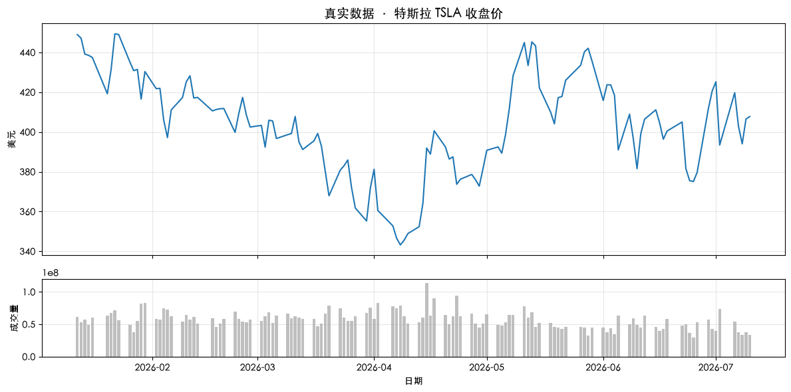

# Quant-for-Beginners Task2：什么是量化金融学习笔记

日期：2026-07-14

## 1. 今天学习的 Task

本次完成 Task2，学习第一章“什么是量化金融”。量化金融不是依靠感觉预测涨跌，而是把投资想法转化为可以计算、验证和重复执行的规则，基本过程是“假设 → 数据 → 验证 → 规则”。

## 2. 完成的课程要求

- 阅读第一章，理解量化研究中“数据 + 规则”的核心思想。
- 梳理了“数据获取 → 数据分析 → 策略设计 → 历史回测 → 模拟交易”的基本流程。
- 运行价格随机路径和仓位管理实验，观察概率优势与风险控制对长期结果的影响。
- 完成章节小挑战：将示例股票改为 `TSLA`，下载近 6 个月行情，并绘制收盘价和成交量图表。

## 3. 知识点总结

### 3.1 量化金融的核心

量化金融是用数据和明确规则辅助金融决策，而不是依靠感觉猜测下一次涨跌。一个想法只有被写成可以计算的指标、用历史数据检验，并转化为可重复执行的规则，才进入量化研究范畴。课程给出的核心循环是：

```text
提出假设 → 获取数据 → 历史验证 → 形成规则 → 持续迭代
```

### 3.2 从研究到交易的基本流程

完整流程通常包括数据获取、清洗与分析、策略设计、历史回测和模拟交易。数据分析回答市场过去发生了什么，策略规则说明在什么条件下行动，回测检验规则在历史上的收益和风险，模拟交易再验证数据延迟、成交和程序运行等实际问题。Python 为这些环节提供统一工具链，因此适合快速把研究想法转成可运行实验。

### 3.3 随机性与统计规律

随机游走实验说明，单条价格路径可能受到大量随机波动影响，很难准确预测每一步；但重复模拟许多路径后，最终价格的分布、均值和离散程度会呈现统计规律。量化研究的重点不是消除不确定性，而是在承认不确定性的前提下，寻找可以重复验证的概率优势并控制风险。

### 3.4 概率优势、仓位与长期纪律

较高胜率并不自动等于长期盈利。最终结果同时取决于胜率、盈亏比、每次投入比例和能否持续执行。如果仓位过大，少量连续亏损就可能严重破坏本金，使后续即使出现盈利机会也难以恢复。因此，量化策略需要把“有没有优势”和“为这个优势投入多少资金”分开研究。

### 3.5 长期平均对数增长率与凯利公式

多次交易后的财富按复利连乘。假设胜率为 $p$、败率为 $q=1-p$，每投入 1 元在盈利时净赚 $b$ 元，每次投入资金比例为 $f$，则每次交易的期望对数增长率为：

$$
g(f)=p\ln(1+bf)+q\ln(1-f)
$$

对 $f$ 求最大值，可以得到凯利仓位：

$$
f^*=\frac{bp-q}{b}
$$

对数把财富的连乘转换为相加，并会严厉惩罚接近破产的结果。以课程中的 1:1 盈亏比和 52% 胜率为例，凯利仓位为 $2\times52\%-1=4\%$：仓位更小会降低理论增长速度，仓位过大则可能使长期对数增长率转为负数。

### 3.6 凯利公式的适用限制

凯利公式只在“最大化长期复利增长率”这一目标下最优，而且依赖胜率、盈亏比相对稳定、交易可以重复等假设。真实市场还存在估计误差、相关性、手续费、滑点和大幅回撤，因此满凯利通常过于激进，半凯利或四分之一凯利更能容忍参数估计偏差。AI 和数据工具可以辅助研究，但不能替代对策略逻辑、数据质量和风险的判断。

## 4. 运行结果与学习记录

### 4.1 运行代码

```python
import warnings

import matplotlib.pyplot as plt
import yfinance as yf
from IPython.display import display

warnings.filterwarnings('ignore')
plt.rcParams['font.sans-serif'] = [
    'Heiti SC', 'PingFang SC', 'Microsoft YaHei', 'SimHei',
    'Noto Sans CJK SC', 'WenQuanYi Micro Hei', 'DejaVu Sans',
]
plt.rcParams['axes.unicode_minus'] = False

# 下载 TSLA 最近 6 个月的日线行情
tsla = yf.download(
    'TSLA', period='6mo', progress=False, multi_level_index=False
)

print('🎉 恭喜！你已经拿到真实股票数据')
print(f'   共 {len(tsla)} 个交易日')
print(f'   最新收盘价: ${tsla["Close"].iloc[-1]:.2f}')
display(tsla.tail(5))

# 上图绘制收盘价，下图绘制成交量
fig, axes = plt.subplots(
    2, 1, figsize=(12, 6), sharex=True,
    gridspec_kw={'height_ratios': [3, 1]},
)
axes[0].plot(
    tsla.index, tsla['Close'], color='tab:blue', linewidth=1.5
)
axes[0].set_title('真实数据 · 特斯拉 TSLA 收盘价', fontsize=14)
axes[0].set_ylabel('美元')
axes[0].grid(True, alpha=0.3)

axes[1].bar(
    tsla.index, tsla['Volume'], width=0.8, color='gray', alpha=0.5
)
axes[1].set_ylabel('成交量')
axes[1].set_xlabel('日期')
axes[1].grid(True, alpha=0.3)

plt.tight_layout()
plt.show()
```

### 4.2 运行输出

以下是 2026-07-14 完成笔记时保存的运行结果。代码使用滚动时间参数 `period='6mo'`，未来重新运行时，交易日数量、最新价格和图表会随行情更新。

```text
标的：TSLA
区间：最近 6 个月
交易日数量：124
最新收盘价：$407.76（2026-07-10）
走势观察：价格从约 $440 回落至 $408，近 6 个月整体偏跌。
```



### 4.3 学习记录

仓位实验也让我看到：即使胜率提高到 52%，下注比例仍会显著改变长期结果。按约 4% 的比例控制仓位时，实验结果明显好于无优势组；一次投入 25% 则可能因连续亏损快速耗尽资金。因此，量化交易不仅要寻找可验证的概率优势，还需要合理的仓位管理和长期纪律。

## 5. 学习心得

通过第一章的学习，我理解了量化金融不是凭感觉预测涨跌，而是把投资想法转化为可计算、验证和重复执行的规则。我运行了 TSLA 近 6 个月行情分析，共获得 124 个交易日数据，最新收盘价为 407.76 美元；仓位实验也让我认识到，即使有概率优势，合理的仓位管理和长期纪律仍然决定策略能否持续。

我的理解是，量化的价值不在于准确预测每一次涨跌，而在于用历史数据检验假设，把有效方法写成可重复执行的规则，并持续评估收益、回撤和风险。凯利公式进一步提醒我，策略研究不能只看胜率；概率优势、仓位管理、交易成本和长期纪律必须结合起来，才能判断一套方法是否具备持续性。

## 6. 还没完全懂的问题

我还想进一步理解：在历史回测中发现的概率优势，应该如何判断它是真实有效，而不是偶然结果或过拟合？加入手续费、滑点和不同市场阶段后，又该用哪些指标确认策略仍然可靠？
