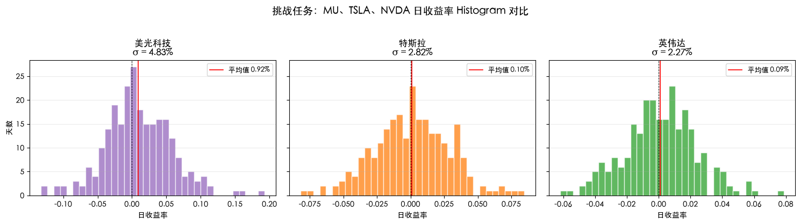
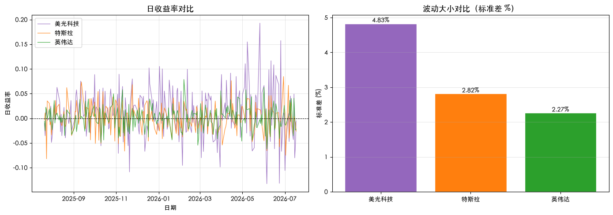

# Quant-for-Beginners Task3：你的第一个量化实验学习笔记

日期：2026-07-16

## 1. 今天学习的 Task

本次完成 Task3，学习第二章“你的第一个量化实验”。重点是认识股票日线数据中的 OHLCV 字段，用 pandas 计算日收益率，并通过收益率曲线、累计收益率和 Histogram 比较不同股票的波动特征。

## 2. 完成的课程要求

- 理解 Open、High、Low、Close 和 Volume 五个行情字段的含义。
- 掌握收益率公式，并使用 `pct_change()` 计算整列日收益率。
- 绘制日收益率曲线、累计收益率曲线和 Histogram。
- 使用日收益率标准差比较股票波动大小。
- 完成挑战任务：用美光科技 `MU` 替换苹果，与 `TSLA`、`NVDA` 进行近 1 年波动对比。
- 回答 Histogram 长尾问题，认识极端涨跌与尾部风险。

## 3. 知识点总结

### 3.1 OHLCV 行情数据

日线行情表通常以交易日为索引，每一行记录一天的数据：`Open` 是开盘价，`High` 是最高价，`Low` 是最低价，`Close` 是收盘价，`Volume` 是成交量。价格必须满足最低价不高于开盘价和收盘价、最高价不低于开盘价和收盘价。量化分析最常从 `Close` 开始，因为它能形成连续的时间序列。

### 3.2 简单收益率与 `pct_change()`

收益率用相对变化衡量涨跌，使不同价格水平的股票可以在同一尺度上比较。简单日收益率为：

$$
r_t=\frac{P_t-P_{t-1}}{P_{t-1}}=\frac{P_t}{P_{t-1}}-1
$$

在 pandas 中，`df['Close'].pct_change()` 会按相邻两行完成同样的计算。第一天没有前一日价格，因此结果为 `NaN`；分析前通常使用 `dropna()` 去除这一行，而不是把它误填为零。

### 3.3 累计收益率与复利

多日收益不能直接相加，而要把每天的增长因子 $(1+r_t)$ 连乘：

$$
R_{1:T}=\prod_{t=1}^{T}(1+r_t)-1
$$

对应的 pandas 写法是 `(1 + rets).cumprod() - 1`。累计收益率曲线反映一笔资金从起点持有到每个日期时的总体涨跌，比单独观察每日波动更适合判断区间表现。

### 3.4 收益率曲线与 Histogram

日收益率曲线保留时间顺序，可以观察波动聚集、异常日期和市场状态变化；Histogram 放弃日期顺序，把收益率按区间计数，用来观察分布中心、离散程度和长尾。两者回答的问题不同，应结合使用，而不能只看其中一张图。

### 3.5 用标准差比较波动

日收益率标准差描述收益率围绕均值的离散程度，标准差越大，通常表示每天的涨跌范围越宽。因为使用的是收益率而不是价格，所以可以比较 MU、TSLA、NVDA 等价格水平不同的股票。标准差的样本区间必须保持一致，否则比较结果可能受到时间窗口差异影响。

### 3.6 标准差的局限与尾部风险

标准差会同时把上涨和下跌偏离视为波动，无法直接区分“有利波动”和亏损风险；一个数值也会隐藏收益率分布是否偏斜、是否存在极端长尾。Histogram 尾巴较长，意味着少数交易日可能出现远离平均水平的大涨或大跌。因此，后续还需要结合滚动波动率、分位数、下行波动率和最大回撤理解风险。

### 3.7 关键函数与波动比较算法

#### 函数与方法速查

| 函数或方法 | 关键参数 | 返回值 | 本 Task 中的用途 |
| --- | --- | --- | --- |
| `Series.pct_change()` | `periods` 指比较间隔，默认 1 | 与原序列等长的收益率 `Series` | 计算相邻交易日收盘价的简单收益率 |
| `Series.dropna()` | 可使用 `subset`、`how` 等参数；默认返回新对象 | 删除缺失值后的 `Series` 或 `DataFrame` | 去除 `pct_change()` 产生的首行 `NaN` 和无效行情 |
| `Series.std(ddof=1)` | `ddof` 是自由度修正，默认 1 | 浮点数 | 计算日收益率的样本标准差 |
| `pd.Series(mapping)` | 字典、列表或数组，可指定 `dtype`、`name` | 一维带索引数据 | 把股票名称到波动率的映射变成可排序序列 |
| `Series.sort_values()` | `ascending=False` 表示降序 | 排序后的新 `Series` | 把波动最大的股票排在最前面 |
| `Axes.hist()` | 数据、箱数 `bins`、颜色和透明度 | 计数、箱边界和图形对象 | 观察收益率分布中心、离散程度和长尾 |
| `Axes.plot()` | 日期索引、收益率、颜色和线宽 | `Line2D` 对象列表 | 保留波动发生的时间位置，识别异常日期和波动聚集 |

`pct_change()` 计算的是相对变化，不是“百分点差”。例如价格从 100 上涨到 103，对应收益率为 $(103/100)-1=3\%$。第一行没有前一期价格，因此必然是 `NaN`；这是一条没有定义的收益率，而不是 0 收益。

#### 多股票波动比较流程

1. 为 MU、TSLA、NVDA 使用相同的 `period='1y'` 下载日线，确保比较窗口口径一致。
2. 选取每只股票的 `Close`，调用 `pct_change()` 转换到可横向比较的日收益率尺度。
3. 用 `dropna()` 清除首行和无效数据；如需严格逐日对齐，应再对三只股票取共同日期交集。
4. 对每条收益率序列调用 `std(ddof=1)`，得到样本日波动率。
5. 把结果放入 `pd.Series` 并降序排列，确定波动率排名。
6. 同时绘制 Histogram 与时间折线：前者看分布形状和尾部，后者看波动发生的时间及聚集现象。

#### 复杂度与边界情况

假设有 $k$ 只股票，每只包含约 $n$ 个交易日。收益率计算、缺失值清理、标准差和绘图都需要遍历数据，主要时间复杂度为 $O(kn)$，保存全部收益率的空间复杂度为 $O(kn)$；对 $k$ 个标准差排序的复杂度为 $O(k\log k)$。通常 $n$ 远大于 $k$，因此时间主要花在数据下载和逐行统计上。

- `std()` 默认使用 `ddof=1` 计算样本标准差；若使用 `ddof=0`，得到的是总体标准差，数值会略小。
- 极端单日收益会显著放大标准差，不能仅凭一个数值判断风险是否稳定。
- 相同的 `period` 不一定保证每条序列日期完全一致；停牌、缺失值或交易日差异会改变样本数。
- 股票拆分和分红会影响价格序列，比较前需要明确 `yfinance` 当前版本的复权设置，并在所有标的上使用相同口径。
- Histogram 的形状会受到 `bins` 数量影响；箱数过少会隐藏细节，过多会放大样本噪声。

#### 最小示例

```python
import pandas as pd
import yfinance as yf

tickers = {'MU': '美光科技', 'TSLA': '特斯拉', 'NVDA': '英伟达'}
returns_by_name = {}

for symbol, name in tickers.items():
    data = yf.download(
        symbol, period='1y', progress=False, multi_level_index=False
    ).dropna()
    if data.empty:
        raise RuntimeError(f'未获取到 {symbol} 行情')
    returns_by_name[name] = data['Close'].pct_change().dropna()

volatility = pd.Series({
    name: returns.std(ddof=1)
    for name, returns in returns_by_name.items()
}).sort_values(ascending=False)

print(volatility.apply(lambda value: f'{value:.3%}'))
print('波动最大：', volatility.index[0])
```

## 4. 运行结果与学习记录

### 4.1 运行代码

```python
import warnings

import matplotlib.pyplot as plt
import pandas as pd
import yfinance as yf

warnings.filterwarnings('ignore')
plt.rcParams['font.sans-serif'] = [
    'Heiti SC', 'PingFang SC', 'Microsoft YaHei', 'SimHei',
    'Noto Sans CJK SC', 'WenQuanYi Micro Hei', 'DejaVu Sans',
]
plt.rcParams['axes.unicode_minus'] = False

# 下载三只股票近 1 年行情并计算日收益率
challenge_tickers = {
    'MU': '美光科技',
    'TSLA': '特斯拉',
    'NVDA': '英伟达',
}
challenge_rets = {}

for symbol, name in challenge_tickers.items():
    data = yf.download(
        symbol, period='1y', progress=False, multi_level_index=False
    ).dropna()
    challenge_rets[name] = data['Close'].pct_change().dropna()
    print(f'{name} ({symbol}): {len(challenge_rets[name])} 个交易日')

# 使用日收益率标准差比较波动大小
challenge_vol = pd.Series({
    name: returns.std() for name, returns in challenge_rets.items()
}).sort_values(ascending=False)

print('\n=== 日收益率波动（标准差，越大越猛）===')
for name, value in challenge_vol.items():
    print(f'  {name}: {value:.3%}')
print(f'\n波动最大的是：{challenge_vol.index[0]}')

# 图一：三只股票的日收益率 Histogram
challenge_colors = ['tab:purple', 'tab:orange', 'tab:green']
fig, axes = plt.subplots(1, 3, figsize=(15, 4), sharey=True)

for ax, (name, returns), color in zip(
    axes, challenge_rets.items(), challenge_colors
):
    ax.hist(
        returns.values, bins=35, color=color,
        alpha=0.75, edgecolor='white',
    )
    ax.axvline(0, color='black', linestyle='--', linewidth=0.7)
    ax.axvline(
        returns.mean(), color='red', linewidth=1.2,
        label=f'平均值 {returns.mean():.2%}',
    )
    ax.set_title(f'{name}\nσ = {returns.std():.2%}')
    ax.set_xlabel('日收益率')
    ax.legend(fontsize=9)
    ax.grid(True, axis='y', alpha=0.25)

axes[0].set_ylabel('天数')
fig.suptitle(
    '挑战任务：MU、TSLA、NVDA 日收益率 Histogram 对比',
    fontsize=14, y=1.03,
)
plt.tight_layout()
plt.show()

# 图二：日收益率时间变化与标准差柱状图
challenge_color_map = dict(zip(challenge_rets.keys(), challenge_colors))
fig, axes = plt.subplots(1, 2, figsize=(14, 5))

for name, returns in challenge_rets.items():
    axes[0].plot(
        returns.index, returns.values,
        color=challenge_color_map[name], linewidth=0.9,
        alpha=0.85, label=name,
    )
axes[0].axhline(0, color='black', linestyle='--', linewidth=0.7)
axes[0].set_title('日收益率对比', fontsize=13)
axes[0].set_xlabel('日期')
axes[0].set_ylabel('日收益率')
axes[0].legend()
axes[0].grid(True, alpha=0.3)

bar_colors = [challenge_color_map[name] for name in challenge_vol.index]
bars = axes[1].bar(
    challenge_vol.index, challenge_vol.values * 100,
    color=bar_colors, edgecolor='white',
)
axes[1].set_title('波动大小对比（标准差 %）', fontsize=13)
axes[1].set_ylabel('标准差 (%)')
axes[1].grid(True, axis='y', alpha=0.3)
for bar, value in zip(bars, challenge_vol.values):
    axes[1].text(
        bar.get_x() + bar.get_width() / 2, bar.get_height(),
        f'{value:.2%}', ha='center', va='bottom', fontsize=10,
    )

plt.tight_layout()
plt.show()
```

### 4.2 运行输出

以下是 2026-07-16 完成笔记时保存的运行结果。代码使用滚动时间参数 `period='1y'`，未来重新运行时，交易日数量和波动率会随样本窗口更新。

```text
美光科技（MU）：250 个交易日，日收益率标准差 4.831%
特斯拉（TSLA）：250 个交易日，日收益率标准差 2.816%
英伟达（NVDA）：250 个交易日，日收益率标准差 2.265%
波动最大的是：美光科技
```





### 4.3 学习记录

Histogram 显示，大部分日收益率集中在零附近，但三只股票都存在较长尾部。美光科技的分布范围最宽，说明它在样本期内不仅日常波动更大，出现极端单日涨跌的幅度也更明显。

日收益率折线保留了波动发生的时间信息，可以看出三只股票的收益率大多围绕零上下变化，同时也能定位少数明显的极端涨跌日。右侧柱状图按标准差从高到低排列，直观显示美光科技（MU）波动最大，为 4.831%；其次是特斯拉（TSLA），为 2.816%；英伟达（NVDA）为 2.265%。

## 5. 学习心得

这次实验让我理解了，直接比较股票价格没有太大意义，因为不同股票的价格基准不同；转换成日收益率后，才可以在统一尺度上比较涨跌和风险。标准差能够快速描述收益率的离散程度，但它会把上涨和下跌波动都视为风险，也不能完整反映分布长尾。Histogram 提醒我，平均收益率和标准差只是概括，真正影响仓位和风险控制的往往是少数极端行情，因此后续分析还需要结合分位数、最大回撤和滚动波动率。

## 6. 还没完全懂的问题

如果一只股票的高波动主要来自少数突发事件，应该怎样判断这种波动是持续特征还是短期异常？除了标准差之外，滚动波动率、下行波动率和分位数指标分别适合在什么场景使用？
