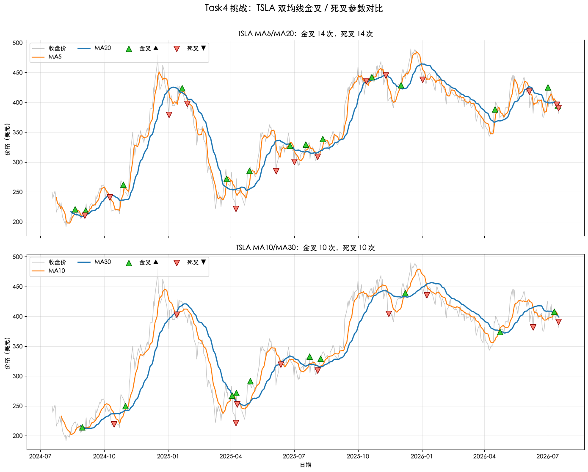

# Quant-for-Beginners Task4：移动平均线策略学习笔记

日期：2026-07-18

## 1. 今天学习的 Task

本次完成 Task4，学习第三章“移动平均线策略”。目标是用移动平均线过滤价格噪声，把“短期趋势强于长期趋势”的直觉写成可执行规则，并识别金叉、死叉和持仓状态。

## 2. 完成的课程要求

- 理解上涨趋势、下跌趋势和短期噪声的区别。
- 使用 `rolling(n).mean()` 计算简单移动平均线。
- 将 `MA5 > MA20` 写成持仓信号，并用均线差值的符号变化识别金叉和死叉。
- 将挑战标的改为 `TSLA`，绘制近 2 年均线和买卖信号图。
- 比较 MA5/MA20 与 MA10/MA30 的信号数量。
- 回答“金叉是否一定赚钱，以及为什么需要回测”的思考题。

## 3. 知识点总结

### 3.1 趋势与噪声

趋势描述价格在一段时间内的整体方向，噪声是消息、成交和短期情绪造成的日常抖动。只看原始收盘价容易被局部波动干扰，因此趋势策略需要先用平滑方法降低噪声，再把观察到的方向转成明确规则。

### 3.2 简单移动平均线

$n$ 日简单移动平均线是最近 $n$ 个收盘价的算术平均：

$$
MA_n(t)=\frac{1}{n}\sum_{i=0}^{n-1}P_{t-i}
$$

pandas 中使用 `df['Close'].rolling(n).mean()` 计算。前 $n-1$ 行因为历史数据不足会得到 `NaN`，识别信号时需要先排除这些尚未形成完整窗口的日期。

### 3.3 长短周期的取舍

短周期均线使用较少数据，贴近价格、反应更快，但容易跟随噪声频繁转向；长周期均线更平滑，可以过滤部分短期波动，但确认趋势更慢。MA5/MA20 比 MA10/MA30 更灵敏，因此通常会产生更多交叉和交易信号。

### 3.4 金叉与死叉的识别

先计算短期均线与长期均线的差值：

$$
spread_t=MA_{short}(t)-MA_{long}(t)
$$

当差值由负转正，短均线从下向上穿过长均线，形成金叉；由正转负则形成死叉。代码可以用 `np.sign(spread).diff()` 检查符号变化：结果大于 0 表示金叉，小于 0 表示死叉。

### 3.5 从图形到交易规则

最简单的双均线策略可以写为 `signal = (MA5 > MA20).astype(int)`：`1` 表示持仓，`0` 表示空仓。`signal.diff()` 或交叉标记可以识别持仓状态何时改变。把规则写成 DataFrame 列后，主观的“看起来趋势变强”就变成了可以重复运行、统计和回测的信号。

### 3.6 信号时点、交易成本与回测

均线由收盘价计算，今天收盘后才知道今天的完整信号，因此回测通常使用 `signal.shift(1)`，让信号从下一交易日生效，避免未来函数。金叉也不保证盈利：均线具有滞后性，震荡行情可能产生连续假信号；频繁换仓还会累积手续费和滑点。必须通过回测比较收益、回撤、交易次数和不同市场阶段的表现。

## 4. 运行结果与学习记录

```text
TSLA：501 个交易日
MA5/MA20：金叉 14 次，死叉 14 次，合计 28 次
MA10/MA30：金叉 10 次，死叉 10 次，合计 20 次
```



MA10/MA30 比 MA5/MA20 少产生 8 次交叉信号。较长周期的均线更加平滑，能够过滤一部分短期波动，但确认趋势的速度也更慢。

## 5. 学习心得

移动平均线把每天杂乱的价格变化压缩成更容易观察的趋势，双均线交叉又把这种观察转化成明确规则。不过，信号清晰不等于策略一定赚钱：均线来自历史价格，天然存在滞后；在震荡行情中，价格可能反复穿越均线，形成连续的假金叉和假死叉。更短的参数反应快但交易频繁，更长的参数稳定但可能错过行情前段。因此，不能只挑历史上看起来最漂亮的参数，还要考虑交易成本、不同市场阶段和样本外表现。

回测时还需要使用 `signal.shift(1)`，让今天收盘后得到的信号从下一交易日开始生效，避免无意中使用未来信息。手续费和滑点也可能使看似有效的频繁信号失去盈利能力。

## 6. 还没完全懂的问题

应该如何选择均线周期，才能避免为了迎合某一段历史行情而过拟合？除了比较累计收益，还应怎样结合最大回撤、交易次数、手续费和样本外测试来判断一组参数是否稳定？
