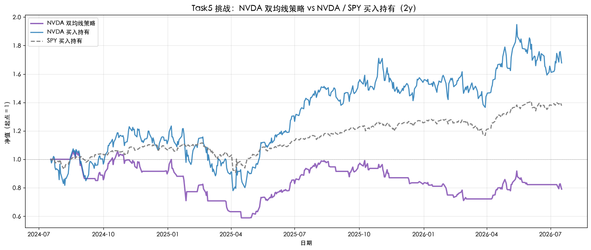

# Quant-for-Beginners Task5：策略回测学习笔记

日期：2026-07-20

## 1. 今天学习的 Task

本次完成 Task5，学习第四章“策略回测”。我把上一章的 MA5/MA20 双均线规则放入历史数据中，使用 `position` 模拟持仓，通过每日收益连乘得到净值，并与 NVDA 买入持有和 SPY 大盘基准比较，同时计算不同样本期的最大回撤。

## 2. 完成的课程要求

- 理解回测是用历史数据模拟规则执行，而不是预测未来。
- 使用 `signal.shift(1)` 让收盘后生成的信号从下一交易日生效，避免未来函数。
- 计算策略、NVDA 买入持有和 SPY 买入持有三条净值曲线。
- 将挑战标的改为 `NVDA`，完成近 2 年策略与大盘对比并绘图。
- 比较 `period='1y'` 和 `'5y'` 的策略最大回撤。
- 用三句话解释回测的用途、执行要求和局限。

## 3. 知识点总结

### 3.1 回测的作用与边界

回测是把事先确定的交易规则放进历史数据，模拟过去每一天会如何生成信号、持仓和获得收益。它可以帮助检查规则是否可执行、收益是否来自少数行情、历史风险是否能够承受，但不能证明未来一定盈利。参数过拟合、数据偏差和市场状态变化都可能使历史表现失效。

### 3.2 信号、仓位与未来函数

`signal` 表示根据今天收盘数据算出的理论状态，`position` 表示账户今天实际持有的仓位。因为今天的完整收盘价只有收盘后才知道，所以应使用：

```python
position = signal.shift(1)
```

这样今天的收益只会使用昨天已经确认的信号。若直接使用当天 `signal` 乘当天收益，就等于提前知道收盘结果，会形成未来函数并夸大回测表现。

### 3.3 日收益率与净值曲线

策略日收益率为：

$$
r_t^{strategy}=position_t\times r_t^{stock}
$$

净值从 1 开始，把每天的增长因子连乘：

$$
NAV_t=\prod_{i=1}^{t}(1+r_i)
$$

策略净值需要同时与同标的买入持有和市场基准比较。只看策略是否赚钱不够，因为上涨市场中的盈利可能只是来自市场整体上涨，而不是交易规则本身带来的超额收益。

### 3.4 最大回撤

先用 `cummax()` 计算每一天之前出现过的最高净值，再计算当前净值相对历史峰值的跌幅：

$$
drawdown_t=\frac{NAV_t}{\max_{i\le t}NAV_i}-1
$$

回撤序列的最小值就是最大回撤。样本越长，遇到不同市场阶段和极端行情的机会越多，因此长期样本的最大回撤通常可能更深，但最终仍应以实际数据为准。

### 3.5 关键函数与方法

| 函数或方法 | 关键参数 | 返回值 | 本 Task 中的用途 |
| --- | --- | --- | --- |
| `DataFrame.join()` | `how='inner'`、索引对齐 | 合并后的 `DataFrame` | 按共同交易日对齐 NVDA 与 SPY |
| `Series.rolling().mean()` | 窗口长度 | 移动平均 `Series` | 计算 MA5 和 MA20 |
| `Series.shift(1)` | 向后移动 1 期 | 延迟后的 `Series` | 让信号下一交易日生效 |
| `Series.pct_change()` | 默认与前一期比较 | 日收益率 `Series` | 计算 NVDA 和 SPY 每日涨跌 |
| `Series.cumprod()` | 累积轴 | 累积乘积 `Series` | 把每日收益转换为净值曲线 |
| `Series.cummax()` | 累积轴 | 历史最高值 `Series` | 构造逐日峰值并计算回撤 |
| `Series.iloc[-1]` | 最后一项的位置索引 | 标量 | 读取样本期末净值并计算累计收益 |

### 3.6 回测算法、复杂度与边界情况

完整流程为：下载并对齐数据 → 计算均线 → 生成信号 → 延迟得到仓位 → 计算策略收益 → 连乘得到净值 → 计算历史峰值和回撤 → 与基准比较。对包含 $n$ 个交易日的数据，滚动均线、收益率、净值和回撤都可以在线性时间内计算，因此时间复杂度为 $O(n)$，保存各列的空间复杂度也是 $O(n)$。

- 下载结果为空或共同交易日太少时，应停止而不是生成虚假指标。
- `inner join` 会只保留两边都有行情的日期，确保收益比较处于同一时间轴。
- 当前实验不含手续费、滑点、税费和现金利息，实际收益会更低。
- 最后一次买入如果样本结束前没有卖出，净值仍按持仓计算，但完整交易回合统计需要单独处理。
- 不同 `period` 使用的是不同滚动时间窗口，未来重跑时指标可能随行情变化。

### 3.7 最小示例

```python
ret = close.pct_change().fillna(0)
signal = (close.rolling(5).mean() > close.rolling(20).mean()).astype(int)
position = signal.shift(1).fillna(0)
strategy_ret = position * ret
nav = (1 + strategy_ret).cumprod()
drawdown = nav / nav.cummax() - 1
max_drawdown = drawdown.min()
```

## 4. 运行结果与学习记录

### 4.1 运行代码

```python
import warnings

import matplotlib.pyplot as plt
import yfinance as yf

warnings.filterwarnings('ignore')
plt.rcParams['font.sans-serif'] = [
    'Heiti SC', 'PingFang SC', 'Microsoft YaHei', 'SimHei',
    'Noto Sans CJK SC', 'WenQuanYi Micro Hei', 'DejaVu Sans',
]
plt.rcParams['axes.unicode_minus'] = False


def run_backtest(ticker, benchmark, period):
    """运行 MA5/MA20 双均线回测，返回逐日结果与核心指标。"""
    stock_raw = yf.download(
        ticker, period=period, progress=False, multi_level_index=False
    ).dropna()
    benchmark_raw = yf.download(
        benchmark, period=period, progress=False, multi_level_index=False
    ).dropna()

    if stock_raw.empty or benchmark_raw.empty:
        raise RuntimeError(f'未获取到 {ticker} 或 {benchmark} 的 {period} 行情')

    stock = stock_raw[['Close']].rename(columns={'Close': 'Stock_Close'})
    market = benchmark_raw[['Close']].rename(columns={'Close': 'Market_Close'})
    result = stock.join(market, how='inner').dropna().copy()
    if len(result) < 21:
        raise ValueError(f'{period} 有效交易日不足，无法计算 MA20')

    result['MA5'] = result['Stock_Close'].rolling(5).mean()
    result['MA20'] = result['Stock_Close'].rolling(20).mean()
    result['signal'] = (result['MA5'] > result['MA20']).astype(int)
    result['position'] = result['signal'].shift(1).fillna(0).astype(int)

    result['stock_ret'] = result['Stock_Close'].pct_change().fillna(0)
    result['market_ret'] = result['Market_Close'].pct_change().fillna(0)
    result['strategy_ret'] = result['position'] * result['stock_ret']

    result['nav_strategy'] = (1 + result['strategy_ret']).cumprod()
    result['nav_buyhold'] = (1 + result['stock_ret']).cumprod()
    result['nav_market'] = (1 + result['market_ret']).cumprod()
    result['drawdown_strategy'] = (
        result['nav_strategy'] / result['nav_strategy'].cummax() - 1
    )

    position_change = result['position'].diff().fillna(0)
    metrics = {
        'trading_days': len(result),
        'strategy_return': result['nav_strategy'].iloc[-1] - 1,
        'buyhold_return': result['nav_buyhold'].iloc[-1] - 1,
        'market_return': result['nav_market'].iloc[-1] - 1,
        'strategy_mdd': result['drawdown_strategy'].min(),
        'buy_count': int((position_change > 0).sum()),
        'sell_count': int((position_change < 0).sum()),
    }
    return result, metrics


backtest_2y, metrics_2y = run_backtest('NVDA', 'SPY', '2y')
backtest_1y, metrics_1y = run_backtest('NVDA', 'SPY', '1y')
backtest_5y, metrics_5y = run_backtest('NVDA', 'SPY', '5y')

relative_gap = metrics_2y['strategy_return'] - metrics_2y['market_return']
relative_result = '跑赢' if relative_gap > 0 else '跑输'
deeper_period = (
    '5y' if abs(metrics_5y['strategy_mdd']) > abs(metrics_1y['strategy_mdd'])
    else '1y'
)
acceptable_period = (
    '1y' if abs(metrics_1y['strategy_mdd']) <= abs(metrics_5y['strategy_mdd'])
    else '5y'
)

print('=== Task5 挑战任务实际结果 ===')
print(f"NVDA 2y 交易日：{metrics_2y['trading_days']}")
print(f"NVDA 双均线策略累计收益：{metrics_2y['strategy_return']:+.2%}")
print(f"NVDA 买入持有累计收益：{metrics_2y['buyhold_return']:+.2%}")
print(f"SPY 买入持有累计收益：{metrics_2y['market_return']:+.2%}")
print(f"策略相对 SPY：{relative_result}（差额 {relative_gap:+.2%}）")
print(f"NVDA 1y 策略最大回撤：{metrics_1y['strategy_mdd']:.2%}")
print(f"NVDA 5y 策略最大回撤：{metrics_5y['strategy_mdd']:.2%}")
print(f'最大回撤更深的区间：{deeper_period}')
print(f'更能接受的区间：{acceptable_period}')
print(
    f"2y 模拟交易：买入 {metrics_2y['buy_count']} 次，"
    f"卖出 {metrics_2y['sell_count']} 次"
)

fig, ax = plt.subplots(figsize=(14, 6))
ax.plot(
    backtest_2y.index, backtest_2y['nav_strategy'],
    color='tab:purple', linewidth=2.2, label='NVDA 双均线策略',
)
ax.plot(
    backtest_2y.index, backtest_2y['nav_buyhold'],
    color='tab:blue', linewidth=1.8, alpha=0.85, label='NVDA 买入持有',
)
ax.plot(
    backtest_2y.index, backtest_2y['nav_market'],
    color='tab:gray', linewidth=1.8, linestyle='--', label='SPY 买入持有',
)
ax.axhline(1.0, color='black', linewidth=0.7, linestyle=':', alpha=0.5)
ax.set_title(
    'Task5 挑战：NVDA 双均线策略 vs NVDA / SPY 买入持有（2y）',
    fontsize=14,
)
ax.set_xlabel('日期')
ax.set_ylabel('净值（起点 = 1）')
ax.legend(loc='upper left')
ax.grid(True, alpha=0.3)
plt.tight_layout()
plt.show()
```

### 4.2 运行输出

以下结果记录于 2026-07-20。代码使用滚动时间窗口，未来重新运行时数据和指标可能变化。

```text
NVDA 2y 交易日：501
NVDA 双均线策略累计收益：-20.99%
NVDA 买入持有累计收益：+67.76%
SPY 买入持有累计收益：+37.68%
策略相对 SPY：跑输（差额 -58.67%）
NVDA 1y 策略最大回撤：-28.41%
NVDA 5y 策略最大回撤：-52.50%
最大回撤更深的区间：5y
更能接受的区间：1y
2y 模拟交易：买入 20 次，卖出 19 次
```



### 4.3 学习记录

在本次 2 年样本中，NVDA 双均线策略累计收益为 -20.99%，而 SPY 买入持有为 +37.68%，策略跑输大盘 58.67 个百分点；NVDA 自身买入持有则达到 +67.76%。这说明双均线规则虽然能够减少部分持仓时间，但在 NVDA 这段整体上涨且波动较大的行情中，频繁离场错过了主要涨幅。

1 年策略最大回撤为 -28.41%，5 年为 -52.50%，更长样本覆盖了更复杂的行情，因此暴露出更深的历史风险。如果只在这两个结果中选择，我更能接受回撤较浅的 1 年结果，但也不能因此忽略 5 年样本提供的长期风险信息。

## 5. 学习心得

这次回测让我看到，一套逻辑清楚的规则并不一定赚钱，更不能只因为图上出现明确的买卖信号就认为策略有效。本次 NVDA 双均线策略不仅跑输 SPY，也远远跑输 NVDA 买入持有，说明趋势信号的滞后和频繁离场可能让策略错过主要上涨阶段。比较 1 年与 5 年最大回撤后，我也理解了短样本可能低估风险；回测必须同时观察收益、基准、回撤和样本长度，并严格使用 `shift(1)` 避免未来函数。

## 6. 还没完全懂的问题

加入手续费、滑点和未平仓交易处理后，这套策略的结果会下降多少？对于参数和市场状态不同的策略，应该怎样划分训练期、验证期和样本外测试期，才能降低过拟合并更可靠地评估未来可用性？
