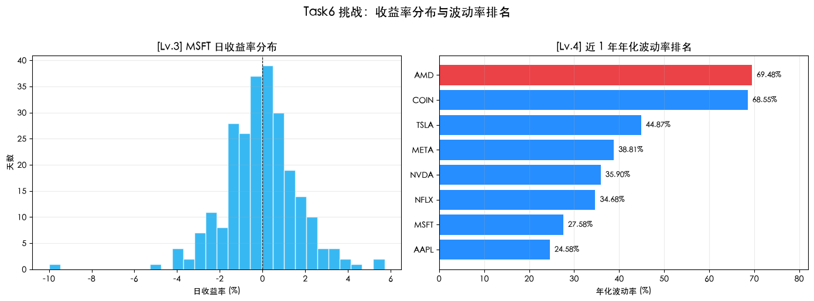

# Quant-for-Beginners Task6：理解波动率学习笔记

日期：2026-07-22

## 1. 今天学习的 Task

本次完成 Task6，学习第五章“理解波动率”。我从价格变化进一步转向收益率分布，用标准差衡量日收益率的离散程度，再通过 $\sqrt{252}$ 转换成年化波动率，并比较多只股票在相同样本窗口下的风险差异。

## 2. 完成的课程要求

- 理解相同终点收益可能对应完全不同的价格路径和持有体验。
- 使用日收益率、样本标准差和年化波动率描述风险。
- 完成 AMD 近 1 年年化波动率计算。
- 将 MSFT 加入 AAPL、TSLA、NVDA 的统一口径比较。
- 绘制 MSFT 日收益率 Histogram，观察收益率分布和尾部。
- 对八只候选股票的近 1 年年化波动率排序并找出最高者。
- 在“未来 5 年不能卖出”的实验中选择 B，并说明风险承受能力与长期坚持的关系。

## 3. 知识点总结

### 3.1 从价格转向收益率

股票价格的绝对变化受价格水平影响，不能直接横向比较。简单收益率把变化统一成比例：

$$
r_t=\frac{P_t}{P_{t-1}}-1
$$

同一只股票的每日收益率形成一条时间序列。观察这条序列围绕零上下波动的范围，比只看价格曲线更适合比较不同标的的风险。

### 3.2 方差、样本标准差与波动率

方差衡量收益率相对均值的平方偏差，标准差把单位还原为收益率：

$$
s=\sqrt{\frac{\sum_{t=1}^{n}(r_t-\bar r)^2}{n-1}}
$$

`pandas.Series.std()` 默认使用 `ddof=1`，计算样本标准差。标准差越大，说明日收益率越分散、价格路径越不稳定。它把上涨和下跌偏离都视为波动，因此不是纯粹的下行风险指标。

### 3.3 日波动率年化

在假设日收益率相互独立、方差可以随时间相加的简化条件下，美股日波动率可以按约 252 个交易日年化：

$$
\sigma_{annual}=\sigma_{daily}\sqrt{252}
$$

年化只是尺度转换，不代表未来一年一定会在这个范围内波动。波动率存在聚集和时变特征，固定窗口的历史估计会随样本期变化。

### 3.4 Histogram、厚尾与异常值

Histogram 把日收益率按区间分箱并统计出现次数。中心柱较高表示多数交易日涨跌接近零；两端仍有观测值则说明存在少量大涨大跌。真实金融收益率经常比正态分布具有更厚的尾部，因此只用均值和标准差可能低估极端风险。

### 3.5 历史波动率的边界与持有体验

历史波动率描述过去价格路径的离散程度，不预测涨跌方向，也不保证高波动带来高收益。样本长度、复权口径、缺失值、公司事件和极端行情都会影响估计结果。对投资者而言，高波动还可能带来更深回撤和更强情绪压力，使人无法坚持原定策略。

本章的 A/B 实验中，我选择预期年收益 20%、年化波动 10% 的 B。未来 5 年不能卖出时，我更重视自己能否承受完整路径，而不是只追求更高的理论终点。

### 3.6 关键函数与方法

| 函数或方法 | 关键参数 | 返回值 | 本 Task 中的用途 |
| --- | --- | --- | --- |
| `yf.download()` | ticker 列表、`period='1y'` | 行情 `DataFrame` | 下载统一窗口的收盘价 |
| `Series.pct_change()` | 默认与前一期比较 | 收益率 `Series` | 将价格转换为日收益率 |
| `dropna()` | 默认删除含缺失值的行 | 清理后的对象 | 删除 `pct_change()` 首行及缺失日期 |
| `Series.std()` | 默认 `ddof=1` | 样本标准差 | 计算日波动率 |
| `np.sqrt()` | 数值或数组 | 平方根 | 使用 $\sqrt{252}$ 年化 |
| `Series.sort_values()` | `ascending` | 排序后的 `Series` | 生成波动率排名 |
| `Axes.hist()` | `bins`、颜色、透明度 | 柱体和分箱信息 | 绘制收益率分布 |
| `Axes.barh()` | 标签、数值、颜色 | 横向柱对象 | 展示八只股票的波动率排名 |

### 3.7 算法流程、复杂度与边界情况

完整流程为：下载同一窗口行情 → 检查空数据 → 提取收盘价 → 计算并清理日收益率 → 计算样本标准差 → 乘 $\sqrt{252}$ 年化 → 排序 → 用 Histogram 和柱状图解释结果。

对 $k$ 只股票、每只约 $n$ 个交易日的数据，收益率和标准差计算约为 $O(kn)$，保存数据约占 $O(kn)$ 空间；对 $k$ 个波动率排序为 $O(k\log k)$。

- 下载为空或单只股票缺列时应停止，不能用零补成虚假结果。
- `pct_change()` 的第一行没有前一日价格，会产生 `NaN`，需要在统计前删除。
- 多标的比较必须使用相同时间窗口和尽量一致的有效日期。
- 股票拆分、分红和数据源复权设置会改变收益率口径，需要在正式研究中明确记录。
- 单个极端收益会显著抬高标准差；应同时查看分布、滚动波动率和最大回撤。
- `period='1y'` 是滚动窗口，未来重新运行时排名和数值可能变化。

### 3.8 最小示例

```python
import numpy as np
import yfinance as yf

close = yf.download('MSFT', period='1y', progress=False)['Close'].squeeze()
returns = close.pct_change().dropna()
annual_volatility = returns.std() * np.sqrt(252)
print(f'MSFT 年化波动率：{annual_volatility:.2%}')
```

## 4. 运行结果与学习记录

### 4.1 运行代码

```python
import warnings

import matplotlib.pyplot as plt
import numpy as np
import pandas as pd
import yfinance as yf

warnings.filterwarnings('ignore')
plt.rcParams['font.sans-serif'] = [
    'Heiti SC', 'PingFang SC', 'Microsoft YaHei', 'SimHei',
    'Noto Sans CJK SC', 'WenQuanYi Micro Hei', 'DejaVu Sans',
]
plt.rcParams['axes.unicode_minus'] = False

TRADING_DAYS = 252


def get_close(data, ticker=None):
    """兼容 yfinance 单标的和多标的返回格式。"""
    close = data['Close']
    if isinstance(close, pd.DataFrame):
        return close[ticker] if ticker else close.squeeze()
    return close


# Lv.1：AMD 年化波动率
lv1_ticker = 'AMD'
lv1_raw = yf.download(lv1_ticker, period='1y', progress=False)
if lv1_raw.empty:
    raise RuntimeError(f'未获取到 {lv1_ticker} 的近 1 年行情')
lv1_ret = get_close(lv1_raw, lv1_ticker).pct_change().dropna()
lv1_ann_vol = float(lv1_ret.std() * np.sqrt(TRADING_DAYS))
print(f'[Lv.1] {lv1_ticker} 年化波动率: {lv1_ann_vol:.2%}')

# Lv.2：加入 MSFT 进行四票比较
lv2_tickers = ['AAPL', 'TSLA', 'NVDA', 'MSFT']
lv2_raw = yf.download(lv2_tickers, period='1y', progress=False)['Close']
if lv2_raw.empty:
    raise RuntimeError('未获取到 Lv.2 标的的近 1 年行情')
lv2_rets = lv2_raw.pct_change().dropna()
lv2_vols = lv2_rets.std() * np.sqrt(TRADING_DAYS)
print('\n[Lv.2] 含 MSFT 的年化波动率：')
print(lv2_vols.sort_values(ascending=False).map(lambda x: f'{float(x):.2%}'))

# Lv.3 / Lv.4：收益率分布与八票波动率排名
candidates = ['AAPL', 'TSLA', 'NVDA', 'MSFT', 'AMD', 'META', 'NFLX', 'COIN']
cand_raw = yf.download(candidates, period='1y', progress=False)['Close']
if cand_raw.empty:
    raise RuntimeError('未获取到 Lv.4 候选标的的近 1 年行情')
cand_vols = cand_raw.pct_change().dropna().std() * np.sqrt(TRADING_DAYS)
cand_vols = cand_vols.sort_values(ascending=False)

print('\n[Lv.4] 近 1 年年化波动率排名：')
for ticker, value in cand_vols.items():
    print(f'  {ticker}: {float(value):.2%}')
print(
    f'\n🏆 波动率最高: {cand_vols.index[0]} '
    f'({float(cand_vols.iloc[0]):.2%})'
)

fig, axes = plt.subplots(1, 2, figsize=(14, 5))
axes[0].hist(
    lv2_rets['MSFT'] * 100,
    bins=30,
    color='#00A4EF',
    alpha=0.78,
    edgecolor='white',
)
axes[0].axvline(0, color='black', linestyle='--', linewidth=0.8)
axes[0].set_title('[Lv.3] MSFT 日收益率分布', fontsize=13)
axes[0].set_xlabel('日收益率 (%)')
axes[0].set_ylabel('天数')
axes[0].grid(axis='y', alpha=0.25)

plot_vols = cand_vols.sort_values(ascending=True) * 100
bar_colors = [
    '#E82127' if ticker == cand_vols.index[0] else '#007AFF'
    for ticker in plot_vols.index
]
bars = axes[1].barh(
    plot_vols.index,
    plot_vols.values,
    color=bar_colors,
    alpha=0.85,
)
for bar, value in zip(bars, plot_vols.values):
    axes[1].text(
        value + plot_vols.max() * 0.015,
        bar.get_y() + bar.get_height() / 2,
        f'{value:.2f}%',
        va='center',
        fontsize=9,
    )
axes[1].set_xlim(0, plot_vols.max() * 1.18)
axes[1].set_title('[Lv.4] 近 1 年年化波动率排名', fontsize=13)
axes[1].set_xlabel('年化波动率 (%)')
axes[1].grid(axis='x', alpha=0.25)

fig.suptitle('Task6 挑战：收益率分布与波动率排名', fontsize=15, y=1.02)
plt.tight_layout()
plt.show()
```

### 4.2 运行输出

以下结果记录于 2026-07-22。代码使用近 1 年滚动窗口，未来重新运行时数值和排名可能变化。

```text
[Lv.1] AMD 年化波动率: 69.48%

[Lv.2] 含 MSFT 的年化波动率：
TSLA    44.87%
NVDA    35.90%
MSFT    27.58%
AAPL    24.58%

[Lv.4] 近 1 年年化波动率排名：
AMD     69.48%
COIN    68.55%
TSLA    44.87%
META    38.81%
NVDA    35.90%
NFLX    34.68%
MSFT    27.58%
AAPL    24.58%

波动率最高：AMD（69.48%）
```



### 4.3 学习记录

本次运行中，AMD 近 1 年年化波动率为 69.48%，在八只候选标的中排名第一，COIN 以 68.55% 排名第二。四只常见科技股中，TSLA 为 44.87%，高于 NVDA、MSFT 和 AAPL，说明即使都属于科技或成长类资产，价格路径的稳定程度也可能存在明显差异。

MSFT Histogram 的大多数观测集中在零附近，但左侧出现约 -10% 的极端日收益，右侧也存在超过 5% 的观测。标准差能够把这些变化压缩成一个便于比较的数字，但无法说明极端涨跌发生在哪一天，也不能完整表达分布不对称和厚尾，因此需要把统计指标与图形一起阅读。

## 5. 学习心得

这次学习让我理解，收益率回答的是“每天涨跌了多少”，波动率回答的是“这些涨跌有多不稳定”。本次八票比较中，AMD 和 COIN 的年化波动率接近 70%，明显高于 AAPL 和 MSFT，但这并不代表它们一定能带来更高收益，只说明持有过程更难预测、情绪压力也可能更大。Histogram 中少量远离零点的收益还提醒我，标准差只是总体概括，真实市场存在厚尾和极端事件。未来 5 年不能卖出时，我选择波动较低的 B，因为能长期坚持并避免在剧烈回撤中被迫退出，比追求更高的理论收益更重要。

## 6. 还没完全懂的问题

固定 1 年窗口得到的是一个静态历史波动率。如果市场波动会随时间聚集和变化，应该如何选择滚动窗口，并使用 EWMA、ARCH 或 GARCH 估计下一阶段波动？这些模型相对简单标准差究竟能提高多少风险预测能力？
