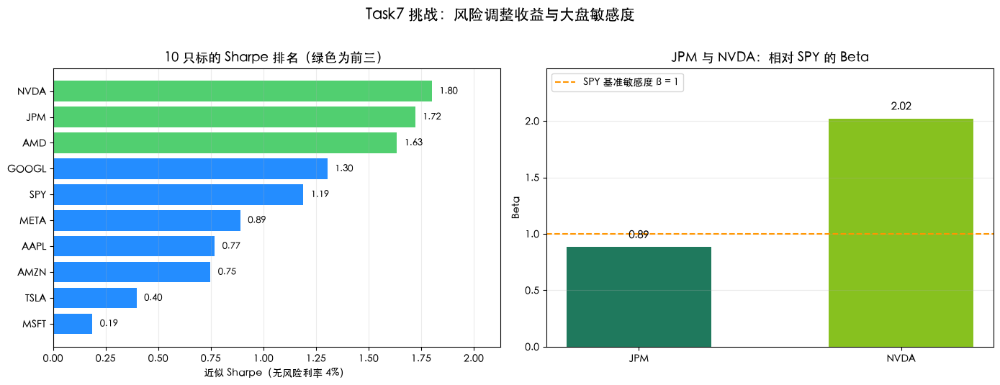

# Quant-for-Beginners Task7：夏普比率与 Beta 学习笔记

日期：2026-07-24

## 1. 今天学习的 Task

本次完成 Task7，学习第六章“夏普比率与 Beta”。我在收益率和波动率的基础上，用夏普比率比较每单位风险对应的超额收益，并用 Beta 衡量个股相对 SPY 大盘的敏感度，最后完成 10 只标的 Sharpe 排名以及 JPM、NVDA 的 Beta 对比。

## 2. 完成的课程要求

- 理解只看收益率不足以评价策略或资产，需要同时考虑承担的风险。
- 使用年化收益、年化波动率和 4% 无风险利率计算近似 Sharpe。
- 绘制 10 只标的的风险—收益散点图。
- 使用 NumPy 和 pandas 两种方法计算个股相对 SPY 的 Beta。
- 对 10 只标的按 Sharpe 降序排列并打印前三名。
- 比较 JPM 与 NVDA 的 Beta，判断谁更贴近大盘 SPY。
- 回答 Sharpe 高是否意味着未来一定更好的思考题。

## 3. 知识点总结

### 3.1 夏普比率：风险调整后的收益

夏普比率把资产超过无风险利率的收益除以总波动风险：

$$
\text{Sharpe}=\frac{R_p-R_f}{\sigma_p}
$$

其中 $R_p$ 是资产或组合年化收益率，$R_f$ 是年化无风险利率，$\sigma_p$ 是年化波动率。数值越高，表示在当前样本和计算口径下，每承担一单位波动风险获得的超额收益越多。

夏普比率不是绝对收益排名。一个收益较低但波动很小的资产，可能比高收益、高波动资产具有更高的风险收益“性价比”。

### 3.2 年化收益、年化波动与无风险利率

本章使用日收益率算术均值进行复利外推：

$$
R_{annual}\approx (1+\bar r_{daily})^{252}-1
$$

年化波动率仍按：

$$
\sigma_{annual}=\sigma_{daily}\sqrt{252}
$$

无风险利率设为 4%，用于扣除不承担股票风险时可能获得的基础回报。无风险利率并非固定常数；当利率环境变化时，同一资产的 Sharpe 也会变化。

### 3.3 Beta：相对大盘的敏感度

个股相对市场的 Beta 定义为：

$$
\beta_i=\frac{\mathrm{Cov}(r_i,r_m)}
{\mathrm{Var}(r_m)}
$$

- $\beta\approx1$：历史涨跌敏感度与市场接近。
- $\beta>1$：相对市场的波动反应更强。
- $0<\beta<1$：通常与市场同向，但历史反应更温和。
- $\beta<0$：与市场存在反向关系，但实际结果需要结合样本和经济逻辑判断。

Beta 衡量的是共同波动的斜率，不等同于相关系数。相关系数只描述同步程度，Beta 还受到个股波动率相对市场波动率的影响。

### 3.4 风险—收益散点图

散点图以年化波动率为横轴、年化收益率为纵轴，可以同时观察“赚多少”和“有多颠”。左上区域通常更理想：收益较高、波动较低；右下区域则代表承担较高波动却没有获得相应收益。

散点图和 Sharpe 都依赖历史样本。一个点在过去三年的位置不能直接当成未来承诺，还需要检查不同窗口、回撤、收益分布和样本外表现。

### 3.5 Sharpe 与 Beta 的局限

Sharpe 把所有波动都视为风险，不能区分上涨波动和下跌波动；当收益率存在偏度、厚尾或极端值时，一个均值和标准差可能掩盖重要风险。Beta 也不是稳定不变的，公司业务、市场环境和样本窗口变化都会让结果漂移。

因此，高 Sharpe 不等于未来一定更好，低 Beta 也不等于一定安全。指标应作为研究工具，与最大回撤、Sortino 比率、滚动窗口和基本面信息共同使用。

### 3.6 关键函数与方法

| 函数或方法 | 关键参数 | 返回值 | 本 Task 中的用途 |
| --- | --- | --- | --- |
| `Series.mean()` | 无 | 均值标量 | 计算日收益率均值 |
| `Series.std()` | 默认 `ddof=1` | 样本标准差 | 计算日波动率 |
| `np.sqrt()` | 数值 | 平方根 | 使用 $\sqrt{252}$ 年化波动率 |
| `Series.sort_values()` | `ascending=False` | 排序后的 `Series` | 生成 Sharpe 排名 |
| `Series.head(3)` | 前三项 | `Series` | 读取 Sharpe 前三名 |
| `np.cov()` | 两条等长序列 | $2\times2$ 协方差矩阵 | 计算股票与市场的协方差 |
| `Series.cov()` | 另一条序列 | 协方差标量 | 用 pandas 交叉验证 Beta |
| `Series.var()` | 默认样本方差 | 方差标量 | 计算市场收益率方差 |
| `DataFrame.loc[]` | 行、列标签 | 标量或切片 | 提取 JPM、NVDA 的 Beta |
| `abs()` | 数值 | 绝对值 | 比较 Beta 距离 1.0 的大小 |
| `Axes.barh()` / `Axes.bar()` | 标签、数值、颜色 | 柱对象 | 绘制 Sharpe 排名和 Beta 对比 |

### 3.7 算法流程、复杂度与边界情况

完整流程为：下载并对齐 $k$ 只标的行情 → 计算日收益率 → 对每只标的计算年化收益、年化波动和 Sharpe → 按 Sharpe 排序 → 以 SPY 为市场序列计算个股协方差和 Beta → 比较 Beta 距离 1 的大小 → 输出文字和图表。

对 $k$ 只股票、每只约 $n$ 个交易日，收益和风险指标计算约为 $O(kn)$，保存价格与收益宽表约占 $O(kn)$ 空间；Sharpe 排序为 $O(k\log k)$，每只股票 Beta 计算为 $O(n)$。

- 所有标的必须按共同交易日对齐，否则协方差和横向比较会失真。
- 年化波动率为零时不能计算 Sharpe，应返回缺失值或主动报错。
- 市场收益率方差接近零时 Beta 分母不稳定。
- 无风险利率必须和收益率使用同一年化口径。
- 极端收益可能同时显著改变年化收益、波动率、Sharpe 和 Beta。
- 前复权口径、样本窗口和数据源必须一致。
- 本章年化收益为基于日均收益的近似外推，不等同于样本实际复合年化收益。

### 3.8 最小示例

```python
import numpy as np

rf_annual = 0.04
annual_return = (1 + stock_returns.mean()) ** 252 - 1
annual_volatility = stock_returns.std() * np.sqrt(252)
sharpe = (annual_return - rf_annual) / annual_volatility
beta = stock_returns.cov(market_returns) / market_returns.var()
```

## 4. 运行结果与学习记录

### 4.1 运行代码

```python
import time
import warnings

import akshare as ak
import matplotlib.pyplot as plt
import numpy as np
import pandas as pd

warnings.filterwarnings('ignore')
plt.rcParams['font.sans-serif'] = [
    'Heiti SC', 'PingFang SC', 'Microsoft YaHei', 'SimHei',
    'Noto Sans CJK SC', 'WenQuanYi Micro Hei', 'DejaVu Sans',
]
plt.rcParams['axes.unicode_minus'] = False

TRADING_DAYS = 252
RF_ANNUAL = 0.04
TICKERS = [
    'AAPL', 'MSFT', 'GOOGL', 'AMZN', 'META',
    'NVDA', 'TSLA', 'AMD', 'JPM', 'SPY',
]


def annualize_return(daily_returns):
    """使用日收益率算术均值近似年化收益。"""
    return (1 + daily_returns.mean()) ** TRADING_DAYS - 1


def annualize_volatility(daily_returns):
    """日收益率标准差乘 sqrt(252)。"""
    return daily_returns.std() * np.sqrt(TRADING_DAYS)


def sharpe_ratio(daily_returns, rf_annual):
    """计算近似 Sharpe。"""
    ann_ret = annualize_return(daily_returns)
    ann_vol = annualize_volatility(daily_returns)
    if ann_vol == 0:
        return np.nan
    return (ann_ret - rf_annual) / ann_vol


def fetch_us_close(symbol, start):
    """下载单只美股前复权收盘价并按日期裁剪。"""
    frame = ak.stock_us_daily(symbol=symbol, adjust='qfq')
    if frame is None or frame.empty:
        raise RuntimeError(f'{symbol} 未返回数据')
    frame['date'] = pd.to_datetime(frame['date'])
    close = (
        frame.set_index('date')
        .sort_index()['close']
        .rename(symbol)
    )
    return close.loc[close.index >= start]


start_date = (
    pd.Timestamp.today() - pd.DateOffset(years=3, days=30)
).strftime('%Y-%m-%d')

frames = {}
for ticker in TICKERS:
    frames[ticker] = fetch_us_close(ticker, start_date)
    time.sleep(1)

prices = pd.DataFrame(frames).dropna()
returns = prices.pct_change().dropna()
if returns.empty:
    raise RuntimeError('对齐后没有足够的共同交易日')

metrics = pd.DataFrame({
    ticker: {
        '年化收益': annualize_return(returns[ticker]),
        '年化波动': annualize_volatility(returns[ticker]),
        'Sharpe': sharpe_ratio(returns[ticker], RF_ANNUAL),
    }
    for ticker in TICKERS
}).T.rename_axis('股票')

market = returns['SPY']
beta_df = pd.DataFrame({
    ticker: {
        'Beta': returns[ticker].cov(market) / market.var()
    }
    for ticker in TICKERS
    if ticker != 'SPY'
}).T.rename_axis('股票')

sharpe_ranking = metrics['Sharpe'].sort_values(ascending=False)
top3 = sharpe_ranking.head(3)
jpm_beta = float(beta_df.loc['JPM', 'Beta'])
nvda_beta = float(beta_df.loc['NVDA', 'Beta'])
jpm_gap = abs(jpm_beta - 1.0)
nvda_gap = abs(nvda_beta - 1.0)
closer_ticker = 'JPM' if jpm_gap < nvda_gap else 'NVDA'

print('=== Task7 挑战任务实际结果 ===')
print(f'样本区间：{prices.index[0].date()} → {prices.index[-1].date()}')
print(f'共同收益率交易日：{len(returns)}')
print('Sharpe 前三名：')
for rank, (ticker, value) in enumerate(top3.items(), start=1):
    print(f'  {rank}. {ticker}: {float(value):.2f}')
print(f'\nJPM Beta: {jpm_beta:.2f}，距 1.0 为 {jpm_gap:.2f}')
print(f'NVDA Beta: {nvda_beta:.2f}，距 1.0 为 {nvda_gap:.2f}')
print(f'更贴近大盘 SPY：{closer_ticker}')

fig, axes = plt.subplots(1, 2, figsize=(14, 5.2))

plot_sharpe = sharpe_ranking.sort_values(ascending=True)
top3_set = set(top3.index)
sharpe_colors = [
    '#34C759' if ticker in top3_set else '#007AFF'
    for ticker in plot_sharpe.index
]
sharpe_bars = axes[0].barh(
    plot_sharpe.index,
    plot_sharpe.values,
    color=sharpe_colors,
    alpha=0.86,
)
for bar, value in zip(sharpe_bars, plot_sharpe.values):
    axes[0].text(
        value + max(plot_sharpe.max(), 0.1) * 0.02,
        bar.get_y() + bar.get_height() / 2,
        f'{value:.2f}',
        va='center',
        fontsize=9,
    )
axes[0].set_xlim(
    min(0, plot_sharpe.min() * 1.15),
    plot_sharpe.max() * 1.18,
)
axes[0].set_title('10 只标的 Sharpe 排名（绿色为前三）', fontsize=13)
axes[0].set_xlabel('近似 Sharpe（无风险利率 4%）')
axes[0].grid(axis='x', alpha=0.25)

beta_tickers = ['JPM', 'NVDA']
beta_values = [jpm_beta, nvda_beta]
beta_bars = axes[1].bar(
    beta_tickers,
    beta_values,
    color=['#006747', '#76B900'],
    width=0.55,
    alpha=0.88,
)
axes[1].axhline(
    1.0,
    color='#FF9500',
    linestyle='--',
    linewidth=1.5,
    label='SPY 基准敏感度 β = 1',
)
for bar, value in zip(beta_bars, beta_values):
    axes[1].text(
        bar.get_x() + bar.get_width() / 2,
        value + max(beta_values) * 0.035,
        f'{value:.2f}',
        ha='center',
        fontsize=11,
    )
axes[1].set_ylim(0, max(beta_values) * 1.22)
axes[1].set_title('JPM 与 NVDA：相对 SPY 的 Beta', fontsize=13)
axes[1].set_ylabel('Beta')
axes[1].legend(loc='upper left')
axes[1].grid(axis='y', alpha=0.25)

fig.suptitle('Task7 挑战：风险调整收益与大盘敏感度', fontsize=15, y=1.02)
plt.tight_layout()
plt.show()
```

### 4.2 运行输出

以下结果记录于 2026-07-24。使用 AkShare 前复权美股日线和约 3 年滚动样本，未来重新运行时结果可能变化。

```text
行情样本：截至运行时最近可用交易日，约 3 年，共 772 个交易日
共同收益率交易日：772

Sharpe 前三名：
1. NVDA: 1.80
2. JPM: 1.72
3. AMD: 1.63

JPM Beta: 0.89，距 1.0 为 0.11
NVDA Beta: 2.02，距 1.0 为 1.02
更贴近大盘 SPY：JPM
```



### 4.3 学习记录

本次约 3 年样本中，NVDA 的年化收益约为 88.41%、年化波动约为 46.86%，近似 Sharpe 为 1.80，位居第一。JPM 年化收益约 45.04%、年化波动约 23.83%，Sharpe 达到 1.72；虽然绝对收益低于 NVDA 和 AMD，但较低波动使其风险调整后表现排名第二。AMD 的年化收益约 96.74%、年化波动约 56.73%，Sharpe 为 1.63，排名第三。

JPM Beta 为 0.89，只比 SPY 的基准敏感度 1.0 低 0.11；NVDA Beta 为 2.02，距离 1.0 达到 1.02。因此 JPM 的历史涨跌更贴近大盘，而 NVDA 对市场变化的反应大约更强。这里的“贴近”只指敏感度斜率，不代表 JPM 与 SPY 每天都会完全同步。

## 5. 学习心得

这次学习让我认识到，收益高不等于投资效率高，必须追问这些收益是用多少波动换来的。JPM 的绝对收益不如 NVDA 和 AMD，却凭借较低波动获得第二高的 Sharpe，说明风险控制本身也能提高投资的“性价比”。Beta 对比则让我看到，JPM 更接近大盘，而 NVDA 的涨跌容易被市场方向放大。Sharpe 和 Beta 都是历史统计结果，不能被当成未来预测；真正使用时还需要观察滚动变化、最大回撤和极端行情，避免被一个漂亮数字误导。

## 6. 还没完全懂的问题

当收益率明显偏离正态分布时，使用 Sortino 比率或其他下行风险指标是否比 Sharpe 更合适？另外，Beta 在不同市场阶段可能变化，应该采用多长的滚动窗口，才能在稳定性和及时性之间取得平衡？
